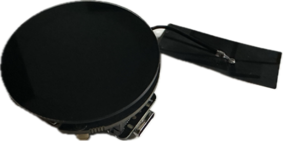

chsc6x Touch Screen Controller
===============================

.. seo::
    :description: Instructions for setting up chsc6x touch screen controller with ESPHome
    :image: chsc6x.png
    :keywords: chsc6x, seeed round display

The ``chsc6x`` touchscreen platform allows using the touch screen controllers based on the chsc6x chip with ESPHome.
The :ref:`I²C <i2c>` is required to be set up in your configuration for this touchscreen to work.

This controller is used in the Seeed Studio Round Display for XIAO with ILI9xxx display

    chsc6x touchscreen on Seeed Studio Round Display

Base Touchscreen Configuration
------------------------------

.. code-block:: yaml

    # Example configuration entry
    touchscreen:
      platform: chsc6x
      id: my_touchscreen
      display: my_display
      interrupt_pin: GPIO44

Configuration variables:
************************

- **id** (*Optional*, :ref:`config-id`): Manually set the ID of this touchscreen.
- **interrupt_pin** (*Optional*, :ref:`Pin Schema <config-pin_schema>`): The touch detection pin.

- All other options from :ref:`Touchscreen <config-touchscreen>`.

Sample config for the ESP32S3
*****************************

.. code-block:: yaml

    i2c:
      sda: GPIO5
      scl: GPIO6

    spi:
      clk_pin: GPIO7
      mosi_pin: GPIO9

    display:
      - platform: ili9xxx
        model: GC9A01A
        auto_clear_enabled: True
        invert_colors: True
        id: my_display
        cs_pin: GPIO2
        dc_pin: GPIO4

    touchscreen:
      platform: chsc6x
      id: my_touchscreen
      display: my_display
      interrupt_pin: GPIO44

See Also
--------

- :apiref:`chsc6x/chsc6x_touchscreen.h`
- :ghedit:`Edit`
